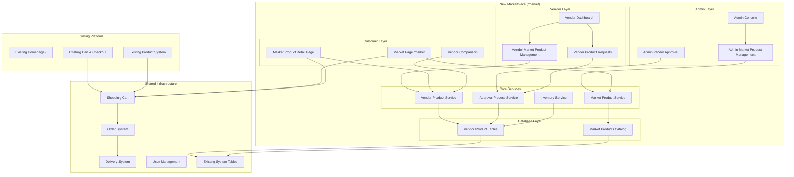

# Design Document

## Overview

The Multi-Vendor Marketplace feature adds a new `/market` page to the existing e-commerce platform, creating a modern quick commerce marketplace similar to Blinkit and Zepto. This is an **additive feature** that runs alongside the existing platform without replacing or modifying current functionality.

The system introduces an admin-controlled product catalog where multiple vendors can sell the same products at different prices, creating a competitive marketplace environment while maintaining quality control through centralized product management.

The design leverages the existing infrastructure including user management, cart system, order processing, and delivery network while introducing new marketplace-specific components for product catalog management, vendor approval workflows, and multi-vendor product comparison. The existing `/` homepage and current product system remain unchanged.

## Architecture

### System Components



### Data Flow Architecture

The marketplace operates on a three-tier product hierarchy:
1. **Market Products** (Admin-managed catalog)
2. **Vendor Product Requests** (Approval workflow)
3. **Vendor Products** (Active marketplace listings)

## Components and Interfaces

### 1. Market Product Catalog Management

#### Market Categories Table
```sql
CREATE TABLE market_categories (
  id UUID PRIMARY KEY DEFAULT uuid_generate_v4(),
  name VARCHAR(255) NOT NULL,
  slug VARCHAR(255) UNIQUE NOT NULL,
  description TEXT,
  image_url TEXT,
  parent_id UUID REFERENCES market_categories(id),
  sort_order INTEGER DEFAULT 0,
  is_active BOOLEAN DEFAULT TRUE,
  seo_title VARCHAR(255),
  seo_description TEXT,
  created_at TIMESTAMPTZ DEFAULT NOW(),
  updated_at TIMESTAMPTZ DEFAULT NOW()
);
```

#### Market Brands Table
```sql
CREATE TABLE market_brands (
  id UUID PRIMARY KEY DEFAULT uuid_generate_v4(),
  name VARCHAR(255) NOT NULL,
  slug VARCHAR(255) UNIQUE NOT NULL,
  logo_url TEXT,
  description TEXT,
  website_url TEXT,
  brand_guidelines TEXT,
  is_active BOOLEAN DEFAULT TRUE,
  created_at TIMESTAMPTZ DEFAULT NOW(),
  updated_at TIMESTAMPTZ DEFAULT NOW()
);
```

#### Market Products Table
```sql
CREATE TABLE market_products (
  id UUID PRIMARY KEY DEFAULT uuid_generate_v4(),
  name VARCHAR(500) NOT NULL,
  slug VARCHAR(500) UNIQUE NOT NULL,
  description TEXT,
  images JSONB, -- Array of image URLs
  specifications JSONB, -- Product specifications as key-value pairs
  category_id UUID NOT NULL REFERENCES market_categories(id),
  brand_id UUID NOT NULL REFERENCES market_brands(id),
  base_unit VARCHAR(50), -- kg, piece, liter, etc.
  weight DECIMAL(10,3),
  dimensions JSONB, -- {length, width, height}
  meta_title VARCHAR(255),
  meta_description TEXT,
  keywords TEXT,
  is_active BOOLEAN DEFAULT TRUE,
  created_by UUID NOT NULL REFERENCES profiles(id),
  created_at TIMESTAMPTZ DEFAULT NOW(),
  updated_at TIMESTAMPTZ DEFAULT NOW()
);
```

### 2. Vendor Product Request System

#### Vendor Product Requests Table
```sql
CREATE TABLE market_vendor_product_requests (
  id UUID PRIMARY KEY DEFAULT uuid_generate_v4(),
  vendor_id UUID NOT NULL REFERENCES vendors(id),
  market_product_id UUID NOT NULL REFERENCES market_products(id),
  proposed_price DECIMAL(10,2) NOT NULL,
  stock_quantity INTEGER NOT NULL,
  delivery_time_hours INTEGER NOT NULL,
  special_terms TEXT,
  business_justification TEXT,
  status VARCHAR(20) DEFAULT 'pending' CHECK (status IN ('pending', 'approved', 'rejected', 'revision_requested')),
  admin_notes TEXT,
  reviewed_by UUID REFERENCES profiles(id),
  reviewed_at TIMESTAMPTZ,
  created_at TIMESTAMPTZ DEFAULT NOW(),
  updated_at TIMESTAMPTZ DEFAULT NOW(),
  UNIQUE(vendor_id, market_product_id)
);
```

### 3. Market Vendor Products (Approved Listings)

#### Market Vendor Products Table
```sql
CREATE TABLE market_vendor_products (
  id UUID PRIMARY KEY DEFAULT uuid_generate_v4(),
  vendor_id UUID NOT NULL REFERENCES vendors(id),
  market_product_id UUID NOT NULL REFERENCES market_products(id),
  price DECIMAL(10,2) NOT NULL,
  original_price DECIMAL(10,2),
  discount_percentage INTEGER DEFAULT 0,
  stock_quantity INTEGER NOT NULL DEFAULT 0,
  is_in_stock BOOLEAN DEFAULT TRUE,
  low_stock_threshold INTEGER DEFAULT 5,
  delivery_time_hours INTEGER NOT NULL,
  min_order_quantity INTEGER DEFAULT 1,
  max_order_quantity INTEGER,
  vendor_notes TEXT,
  is_active BOOLEAN DEFAULT TRUE,
  featured BOOLEAN DEFAULT FALSE,
  last_stock_update TIMESTAMPTZ,
  created_at TIMESTAMPTZ DEFAULT NOW(),
  updated_at TIMESTAMPTZ DEFAULT NOW(),
  UNIQUE(vendor_id, market_product_id)
);
```

### 4. Integration with Existing Cart System

The marketplace integrates seamlessly with the existing cart system, allowing customers to add both existing products and new marketplace products to the same cart. The integration extends the cart_items table to support market vendor products while maintaining full backward compatibility:

```sql
-- Add new column to existing cart_items table (non-breaking change)
ALTER TABLE cart_items ADD COLUMN market_vendor_product_id UUID REFERENCES market_vendor_products(id);

-- Update cart_items constraint to allow either existing products or market products
ALTER TABLE cart_items DROP CONSTRAINT cart_items_product_id_fkey;
ALTER TABLE cart_items ADD CONSTRAINT cart_items_check_product_reference 
  CHECK ((product_id IS NOT NULL AND market_vendor_product_id IS NULL) OR 
         (product_id IS NULL AND market_vendor_product_id IS NOT NULL));

-- Maintain existing foreign key for backward compatibility
ALTER TABLE cart_items ADD CONSTRAINT cart_items_product_id_fkey 
  FOREIGN KEY (product_id) REFERENCES vendor_products(id) ON DELETE CASCADE;

-- Add market_vendor_product_id and product_type to order_items table
ALTER TABLE order_items ADD COLUMN market_vendor_product_id UUID REFERENCES market_vendor_products(id);
ALTER TABLE order_items ADD COLUMN product_type VARCHAR(20) DEFAULT 'existing' 
  CHECK (product_type IN ('existing', 'marketplace'));

-- Add proper constraints to ensure data integrity
ALTER TABLE order_items ADD CONSTRAINT order_items_product_check 
  CHECK (
    (product_type = 'existing' AND vendor_product_id IS NOT NULL AND market_vendor_product_id IS NULL) OR
    (product_type = 'marketplace' AND vendor_product_id IS NULL AND market_vendor_product_id IS NOT NULL)
  );
```

**Key Integration Points:**
- **Unified Cart Experience**: Customers can mix existing products and marketplace products in the same cart
- **Shared Checkout Flow**: Both product types use the same checkout and payment process
- **Order Management**: Orders can contain items from both systems, processed through existing order infrastructure
- **Delivery Integration**: Marketplace products use the same delivery partner network and logistics

### 5. Handling Mixed Product Types in Application Logic

#### Cart Queries and Display
The application must handle both product types when fetching and displaying cart items:

```sql
-- Enhanced cart query to handle both product types
SELECT 
  ci.id,
  ci.quantity,
  ci.added_at,
  -- Existing product data
  CASE WHEN ci.product_id IS NOT NULL THEN
    JSON_BUILD_OBJECT(
      'type', 'existing',
      'id', vp.id,
      'name', sm.model_name,
      'price', vp.price,
      'vendor_name', v.business_name,
      'image', sm.official_images[1],
      'category', c.name
    )
  END as existing_product,
  -- Market product data
  CASE WHEN ci.market_vendor_product_id IS NOT NULL THEN
    JSON_BUILD_OBJECT(
      'type', 'marketplace',
      'id', mvp.id,
      'name', mp.name,
      'price', mvp.price,
      'vendor_name', v2.business_name,
      'image', mp.images->0,
      'category', mc.name,
      'delivery_time', mvp.delivery_time_hours
    )
  END as market_product
FROM cart_items ci
LEFT JOIN vendor_products vp ON ci.product_id = vp.id
LEFT JOIN smartphone_models sm ON vp.model_id = sm.id
LEFT JOIN vendors v ON vp.vendor_id = v.id
LEFT JOIN categories c ON vp.category_id = c.id
LEFT JOIN market_vendor_products mvp ON ci.market_vendor_product_id = mvp.id
LEFT JOIN market_products mp ON mvp.market_product_id = mp.id
LEFT JOIN vendors v2 ON mvp.vendor_id = v2.id
LEFT JOIN market_categories mc ON mp.category_id = mc.id
WHERE ci.cart_id = $1;
```

#### Checkout Page Modifications
The checkout page must group and process both product types:

```typescript
interface CheckoutItem {
  type: 'existing' | 'marketplace';
  id: string;
  name: string;
  price: number;
  quantity: number;
  vendor: {
    id: string;
    name: string;
  };
  deliveryTime?: number; // Only for marketplace products
}

interface CheckoutSummary {
  existingProducts: CheckoutItem[];
  marketplaceProducts: CheckoutItem[];
  vendorGroups: {
    vendorId: string;
    vendorName: string;
    items: CheckoutItem[];
    subtotal: number;
    deliveryFee: number;
  }[];
  totalAmount: number;
  estimatedDeliveryTime: number;
}
```

#### Order Creation Logic
Orders must be created to handle both product types:

```sql
-- Enhanced order_items insertion for mixed products
INSERT INTO order_items (
  order_id,
  vendor_id,
  product_name,
  product_description,
  category_name,
  unit_price,
  quantity,
  line_total,
  vendor_product_id,        -- For existing products
  market_vendor_product_id, -- For marketplace products
  product_type              -- New field to distinguish types
)
SELECT 
  $1 as order_id,
  COALESCE(v1.id, v2.id) as vendor_id,
  COALESCE(sm.model_name, mp.name) as product_name,
  COALESCE(sm.description, mp.description) as product_description,
  COALESCE(c1.name, mc.name) as category_name,
  COALESCE(vp.price, mvp.price) as unit_price,
  ci.quantity,
  COALESCE(vp.price, mvp.price) * ci.quantity as line_total,
  ci.product_id as vendor_product_id,
  ci.market_vendor_product_id,
  CASE 
    WHEN ci.product_id IS NOT NULL THEN 'existing'
    WHEN ci.market_vendor_product_id IS NOT NULL THEN 'marketplace'
  END as product_type
FROM cart_items ci
-- Join logic for both product types (similar to cart query above)
WHERE ci.cart_id = $2;
```

#### My Orders Page Integration
The my-orders page must display both product types with appropriate information:

```typescript
interface OrderItem {
  id: string;
  productType: 'existing' | 'marketplace';
  productName: string;
  productImage: string;
  vendorName: string;
  price: number;
  quantity: number;
  status: string;
  // Marketplace-specific fields
  deliveryTime?: number;
  marketProductId?: string;
}

interface Order {
  id: string;
  orderNumber: string;
  status: string;
  totalAmount: number;
  createdAt: Date;
  items: OrderItem[];
  // Group items by type for better display
  existingItems: OrderItem[];
  marketplaceItems: OrderItem[];
}
```

#### Stock Management Integration
Both product types must be handled in stock updates:

```sql
-- Stock update trigger for marketplace products
CREATE OR REPLACE FUNCTION update_market_product_stock()
RETURNS TRIGGER AS $$
BEGIN
  IF NEW.product_type = 'marketplace' THEN
    UPDATE market_vendor_products 
    SET stock_quantity = stock_quantity - NEW.quantity,
        is_in_stock = CASE WHEN stock_quantity - NEW.quantity <= 0 THEN FALSE ELSE TRUE END,
        last_stock_update = NOW()
    WHERE id = NEW.market_vendor_product_id;
  ELSIF NEW.product_type = 'existing' THEN
    -- Existing stock update logic remains unchanged
    UPDATE vendor_products 
    SET stock_quantity = stock_quantity - NEW.quantity,
        is_in_stock = CASE WHEN stock_quantity - NEW.quantity <= 0 THEN FALSE ELSE TRUE END
    WHERE id = NEW.vendor_product_id;
  END IF;
  RETURN NEW;
END;
$$ LANGUAGE plpgsql;
```

## Data Models

### Market Product Model
```typescript
interface MarketProduct {
  id: string;
  name: string;
  slug: string;
  description: string;
  images: string[];
  specifications: Record<string, any>;
  category: MarketCategory;
  brand: MarketBrand;
  baseUnit: string;
  weight?: number;
  dimensions?: {
    length: number;
    width: number;
    height: number;
  };
  seoData: {
    title: string;
    description: string;
    keywords: string;
  };
  isActive: boolean;
  createdBy: string;
  createdAt: Date;
  updatedAt: Date;
}
```

### Vendor Product Request Model
```typescript
interface VendorProductRequest {
  id: string;
  vendorId: string;
  marketProductId: string;
  proposedPrice: number;
  stockQuantity: number;
  deliveryTimeHours: number;
  specialTerms?: string;
  businessJustification?: string;
  status: 'pending' | 'approved' | 'rejected' | 'revision_requested';
  adminNotes?: string;
  reviewedBy?: string;
  reviewedAt?: Date;
  createdAt: Date;
  updatedAt: Date;
}
```

### Market Vendor Product Model
```typescript
interface MarketVendorProduct {
  id: string;
  vendorId: string;
  marketProductId: string;
  marketProduct: MarketProduct;
  vendor: Vendor;
  price: number;
  originalPrice?: number;
  discountPercentage: number;
  stockQuantity: number;
  isInStock: boolean;
  lowStockThreshold: number;
  deliveryTimeHours: number;
  minOrderQuantity: number;
  maxOrderQuantity?: number;
  vendorNotes?: string;
  isActive: boolean;
  featured: boolean;
  lastStockUpdate?: Date;
  createdAt: Date;
  updatedAt: Date;
}
```

## Error Handling

### Request Validation Errors
- **Invalid Product Request**: When vendor submits request with missing required fields
- **Duplicate Request**: When vendor tries to request same product twice
- **Inactive Product**: When vendor requests to sell inactive market product
- **Price Validation**: When proposed price is below minimum thresholds

### Inventory Management Errors
- **Stock Synchronization**: Handle concurrent stock updates across multiple vendors
- **Negative Stock**: Prevent overselling when multiple customers purchase simultaneously
- **Stock Threshold Alerts**: Notify vendors when stock falls below threshold

### Approval Workflow Errors
- **Permission Denied**: When non-admin users try to approve requests
- **Invalid Status Transition**: When trying to change request status inappropriately
- **Missing Review Notes**: When rejecting requests without providing reasons

## Testing Strategy

### Unit Testing
- **Product Catalog Management**: Test CRUD operations for market products, categories, and brands
- **Vendor Request Processing**: Test request submission, validation, and approval workflows
- **Inventory Management**: Test stock updates, availability checks, and threshold monitoring
- **Price Comparison Logic**: Test vendor ranking and best price calculations

### Integration Testing
- **Cart Integration**: Test adding market vendor products to existing cart system
- **Order Processing**: Test order creation with mixed product types (existing + marketplace)
- **Vendor Dashboard**: Test vendor product management and request submission flows
- **Admin Approval Workflow**: Test complete request-to-approval process

### End-to-End Testing
- **Customer Journey**: Test complete flow from product discovery to purchase
- **Vendor Onboarding**: Test vendor registration and first product request
- **Admin Management**: Test complete admin workflow for catalog and vendor management
- **Multi-Vendor Scenarios**: Test scenarios with multiple vendors selling same product

### Performance Testing
- **Product Search**: Test search performance with large product catalogs
- **Vendor Comparison**: Test performance of vendor comparison queries
- **Concurrent Stock Updates**: Test system behavior under high concurrent stock modifications
- **Database Query Optimization**: Test and optimize complex queries involving multiple joins

### Security Testing
- **Access Control**: Verify proper role-based access to admin and vendor functions
- **Data Validation**: Test input validation for all user-submitted data
- **SQL Injection Prevention**: Test all database queries for injection vulnerabilities
- **Price Manipulation**: Test prevention of unauthorized price modifications