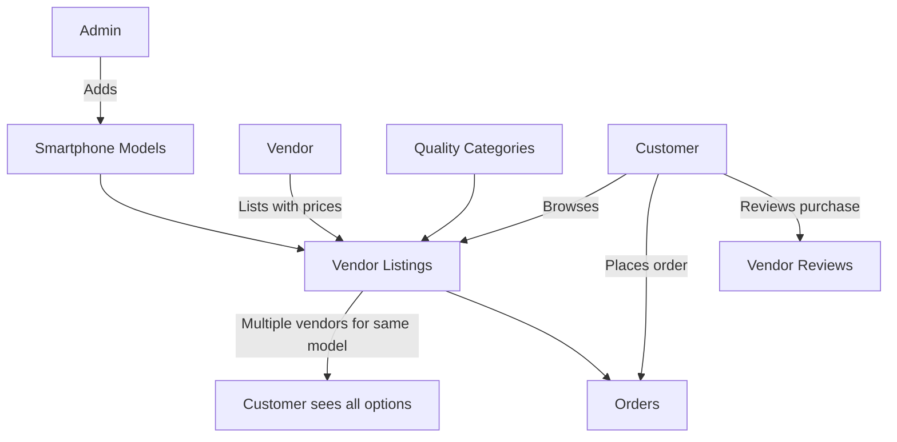

# Tryodo - Smartphone Marketplace

A modern multi-vendor smartphone marketplace where admins manage phone models, vendors list their products with different quality options, and customers can browse and compare all vendor options for specific phone models.

## 🏗️ Database Architecture

The database has been completely redesigned to align with your specific requirements:

### **Role-Based System**
- **Admin**: Adds smartphone brands and models to the marketplace
- **Vendor**: Lists their smartphones with different quality/price options
- **Customer**: Browses all vendor options for each smartphone model

### **Key Features**
- ✅ **Missing `profiles` table** - Now included and properly referenced
- ✅ **Simplified smartphone-focused schema** instead of generic phone parts
- ✅ **Quality-based pricing** - Vendors can list same phone in different conditions
- ✅ **Comprehensive vendor management** with ratings and reviews
- ✅ **Advanced customer features** - wishlists, comparisons, addresses
- ✅ **Analytics tracking** - price history, view tracking
- ✅ **Proper RLS policies** for security

## 📊 Database Schema Overview

### **Core Tables**

1. **`profiles`** - User authentication and role management
2. **`brands`** - Smartphone brands (Apple, Samsung, etc.)
3. **`smartphone_models`** - Specific phone models (iPhone 15 Pro Max, Galaxy S24 Ultra)
4. **`quality_categories`** - Condition types (Brand New, Refurbished, Used, etc.)
5. **`vendors`** - Vendor business information
6. **`vendor_smartphone_listings`** - Vendor product listings with pricing
7. **`customers`** - Customer profiles and preferences
8. **`orders` & `order_items`** - Order management
9. **`vendor_reviews`** - Customer reviews and ratings

### **How It Works**



## 🚀 Setup Instructions

### 1. **Database Setup**

Run the setup scripts in your Supabase SQL editor:

```sql
-- First, run the main schema
\i supabase-setup.sql

-- Then, add sample data
\i sample-data.sql
```

### 2. **Your Existing Users**

Your current users are preserved and will work with the new schema:
- `inet.nishant@gmail.com` - **Admin** (can add smartphone models)
- `nishant0328@gmail.com` - **Vendor** (can list smartphones with pricing)
- `nishant@gmail.com` - **Customer** (can browse and purchase)

### 3. **Environment Variables**

Make sure you have your Supabase credentials in your environment:

```env
VITE_SUPABASE_URL=your_supabase_url
VITE_SUPABASE_ANON_KEY=your_supabase_anon_key
```

## 💡 Key Improvements Made

### **1. Fixed Missing Components**
- ✅ Added missing `profiles` table that your app expects
- ✅ Proper foreign key relationships between auth and business logic
- ✅ Fixed table naming to match your application code

### **2. Smartphone-Focused Design**
- 🔄 **Before**: Generic "phone parts" marketplace
- ✅ **After**: Dedicated smartphone marketplace with models, variants, and quality options

### **3. Better Vendor Experience**
- 📱 Vendors can list the same phone model in different:
  - **Quality conditions** (Brand New, Refurbished, Used, etc.)
  - **Storage variants** (128GB, 256GB, 512GB, 1TB)
  - **Color variants** (Natural Titanium, Blue Titanium, etc.)
  - **Pricing strategies** (original price vs selling price for discounts)

### **4. Enhanced Customer Experience**
- 🛒 **Product comparison** - Compare multiple smartphones
- ❤️ **Wishlists** - Save favorite models
- 📍 **Multiple addresses** - Home, work, etc.
- ⭐ **Detailed reviews** - Rate vendors on multiple criteria
- 📊 **Price tracking** - See price history for listings

## 🎯 Usage Examples

### **Admin Workflow**
```sql
-- Admin adds a new smartphone model
INSERT INTO smartphone_models (brand_id, model_name, model_number, release_year, base_price, specifications)
SELECT 
    b.id, 
    'iPhone 16 Pro Max', 
    'A3999', 
    2024, 
    1299.00,
    '{"screen_size": "6.9", "ram": "12GB", "storage_options": ["256GB", "512GB", "1TB"]}'::jsonb
FROM brands b WHERE b.name = 'Apple';
```

### **Vendor Workflow**
```sql
-- Vendor lists the same phone in different conditions
INSERT INTO vendor_smartphone_listings (vendor_id, smartphone_model_id, quality_category_id, selling_price, storage_variant, color_variant, stock_quantity)
VALUES 
    (vendor_id, model_id, brand_new_quality_id, 1249.00, '256GB', 'Natural Titanium', 10),
    (vendor_id, model_id, refurbished_quality_id, 999.00, '256GB', 'Natural Titanium', 5),
    (vendor_id, model_id, used_quality_id, 849.00, '256GB', 'Natural Titanium', 3);
```

### **Customer Experience**
When a customer searches for "iPhone 15 Pro Max", they see:

| Vendor | Quality | Storage | Color | Price | Warranty | Stock |
|--------|---------|---------|-------|--------|----------|-------|
| TechMart | Brand New | 256GB | Natural Titanium | ₹1,099 | 12 months | ✅ In Stock |
| TechMart | Refurbished | 256GB | Blue Titanium | ₹899 | 6 months | ✅ In Stock |
| ElectroWorld | Brand New | 512GB | Natural Titanium | ₹1,299 | 12 months | ✅ In Stock |

## 📈 Analytics & Insights

The system tracks:
- **Product views** - Which phones are most popular
- **Price history** - Track price changes over time
- **Customer preferences** - Understand buying patterns
- **Vendor performance** - Ratings, reviews, sales volume

## 🔒 Security Features

- **Row Level Security (RLS)** on all user-sensitive tables
- **Role-based access control** - Users can only access appropriate data
- **Audit trails** - Track changes to prices and inventory
- **Data validation** - Constraints ensure data integrity

## 🛠️ Development Notes

### **Key Schema Changes**
1. **`models` → `smartphone_models`** - More specific naming
2. **`categories` → `quality_categories`** - Focus on condition types
3. **`vendor_products` → `vendor_smartphone_listings`** - Better naming
4. **Added `profiles` table** - Required by your auth system
5. **Enhanced relationships** - Proper foreign keys and constraints

### **Generated Columns**
- `discount_percentage` - Automatically calculated from original vs selling price
- `is_in_stock` - Based on stock_quantity > 0
- `line_total` - Calculated from unit_price × quantity

### **Triggers & Functions**
- Auto-update `updated_at` timestamps
- Maintain vendor ratings when reviews are added/updated
- Track price changes in history table
- Ensure only one default address per customer

## 🔄 Migration from Old Schema

If you have existing data in the old schema, you'll need to:

1. **Backup your existing data**
2. **Run the new schema** (it will create new tables)
3. **Migrate your data** using SQL scripts to map old structure to new
4. **Update your application code** to use new table names

## 📞 Support

The new schema is designed to be:
- **Scalable** - Can handle thousands of vendors and millions of products
- **Performant** - Proper indexes for fast queries
- **Maintainable** - Clear relationships and constraints
- **Extensible** - Easy to add new features

Your project is now ready for a modern smartphone marketplace experience! 🚀
